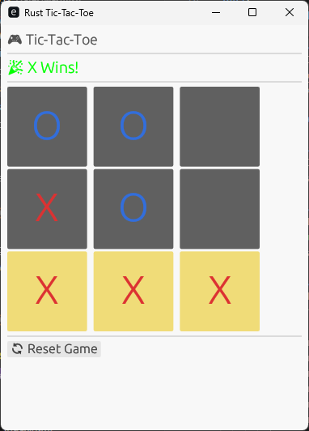
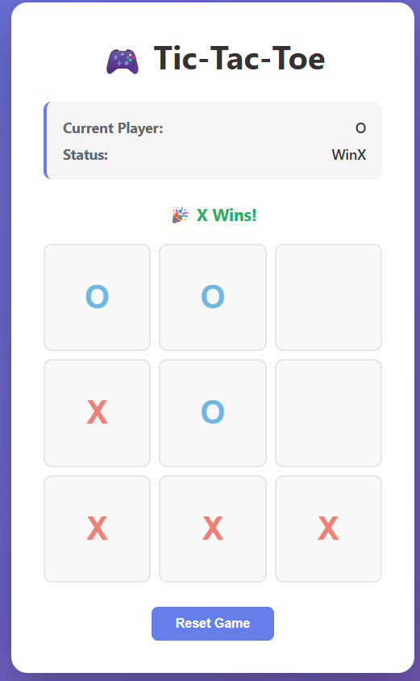
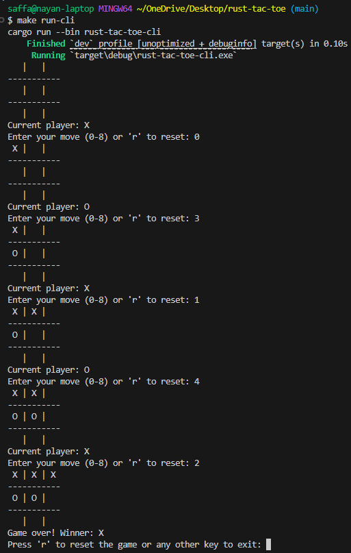

# rust-tac-toe

Learning project implementing `Tic-Tac-Toe` in Rust with multiple interface options.

## Features

- **Console Interface**: Play in the terminal
- **GUI Interface**: Desktop GUI using eframe
- **WebAssembly**: Play in the browser ([Try me](https://saffathasan.github.io/rust-tac-toe/))

## Building and Running

See the [Makefile](Makefile) for building and running commands.

## Layout

```text
.
├── crates
│   ├── cli          # Handles CLI
│   ├── engine       # Core Tic-Tac-Toe logic
│   ├── gui          # Graphical interface
│   └── wasm         # WebAssembly build targets
├── Makefile         # Shortcuts for common tasks (e.g. `make run-gui`)
└── Cargo.toml       # Workspace configuration
```

## Screenshots

| CLI                 | GUI                  | Web (WASM)          |
| ------------------- | -------------------- | ------------------- |
|  |  |  |
